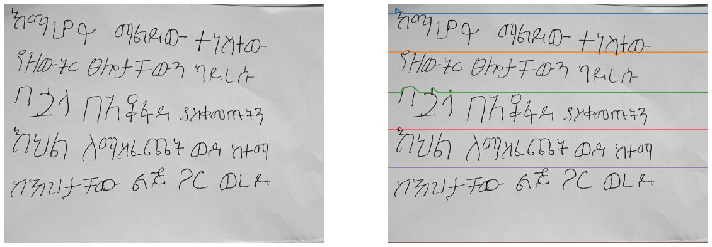
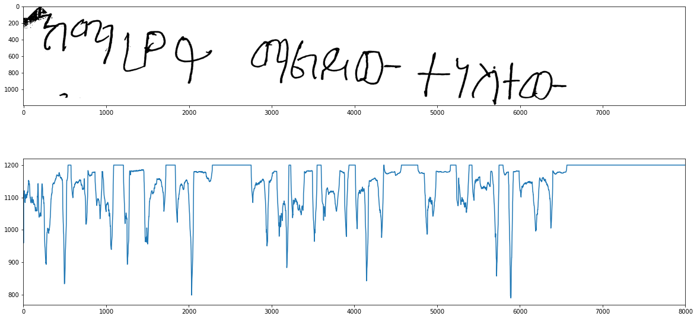

# Amharic Handwritten Text Preprocessing

This project involves preprocessing scanned handwritten Amharic text images and segmenting them into individual sentences. The provided image preprocessing script processes the input image to detect and extract each sentence.

## Features

- Image preprocessing for scanned handwritten text
- Sentence segmentation
- Support for Amharic script

## Requirements

- Python 3.x
- OpenCV
- NumPy
- Matplotlib (optional, for visualization)

## Installation

1. Clone this repository:

    ```bash
    git clone https://github.com/Metasebiya-21/amharic-image-preprocessing.git
    ```

2. Navigate into the project directory:

    ```bash
    cd amharic-image-preprocessing
    ```

3. Install the required Python packages:

    ```bash
    pip install -r requirements.txt
    ```

## Usage

1. Place your scanned handwritten text image in the `images` directory. Ensure the image is in a format supported by OpenCV (e.g., PNG, JPEG).

2. Run the preprocessing script:

    ```bash
    python preprocess.py --image images/your_image.png
    ```

    Replace `your_image.png` with the name of your image file.

3. The script will output the segmented sentences as individual images in the `output` directory.


## Example

Below is an example of the preprocessing steps:

### After Image Pre-Processing
#### input image with pre-processed image after projection

### Segmented Sentences
The output will be individual images for each sentence, saved in the `output` directory.

## Contributing

Contributions are welcome! Please feel free to open issues or submit pull requests.

## License

This project is licensed under the MIT License. See the [LICENSE](LICENSE) file for details.

## Acknowledgements

- [OpenCV](https://opencv.org/) - Open Source Computer Vision Library.
- [NumPy](https://numpy.org/) - Library for scientific computing with Python.
- [Matplotlib](https://matplotlib.org/) - Plotting library for Python (optional, for visualization).

## Contact

For any inquiries or support, please contact [your.email@example.com].
